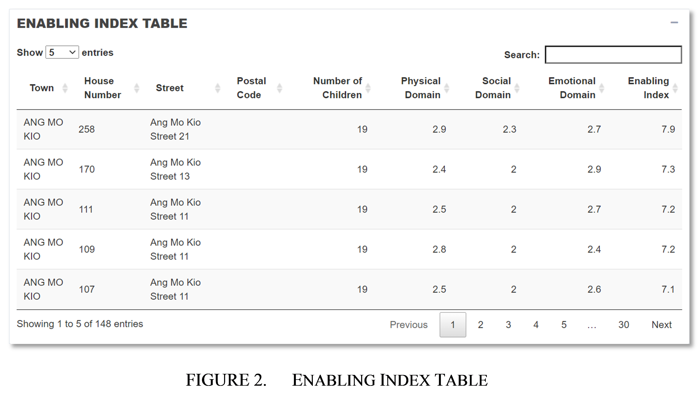

# Introduction 
Children are the future of a nation’s well-being. There is therefore an incentive for the nation to ensure the healthy development of a child into adulthood. The critical period for child development is usually between the ages 1 to 7, during which children are developmentally vulnerable. As such, it is important to measure and evaluate child development early to ensure that the child is developing healthily.

One such way to evaluate child development is based on three development domains formulated by the Australian Early Development Census (AEDC) [@boller2019measuring]: (1) Physical Health and Wellbeing Domain, (2) Social Competence Domain, and (3) Emotional Maturity Domain. A child should develop healthily in these domains to grow up healthily. The definitions for the developmental domains as provided by AEDC can be found in Table 1. 
```{r echo=FALSE, out.width="100%"}

```
There are many factors that affect the healthy development of children, from home environment to genetic make-up, all of which can affect these domains in one way or another.

## Built Spaces and Child Development 
One such factor affecting child development is the built environment that children interact with daily.  Studies on how built spaces affect the development of children have shown that accessibility and interaction with certain built environment like playgrounds and green spaces [@engemann2019residential], has an influence on child development.

However, cities are not always planned with this understanding in mind. This results in unequal opportunities, with some children living in areas where they are more developmentally enabled by the built environment, while others are not as privileged.

## Project Focus and Objective
In Singapore, this is especially relevant for public housing. Public estates are sometimes at a disadvantage, as compared to private housing where developers are already incentivised or expected to provide some of the built environment factors (e.g. green spaces, recreation spaces). As such, understanding how enabling different public housing are for childhood development will be the focus area for this project.

Geospatial analysis of Singapore’s neighbourhoods can be conducted to map and understand gaps in spatial planning, pinpointing areas that might require intervention. To do so, based on the developmental domains previously discussed, the related built environment factors that impact the healthy development of children can be further identified [@christian2017relationship]. These built factors were selected and filtered based on the Singapore context and grouped into the respective developmental domains as shown in Table 2
```{r echo=FALSE, out.width="100%"}

```
The identification of built environment factors thus provides a basis for deriving a better understanding of the current spatial situation in Singapore, in relation to child development. By analysing the accessibility of public housing to these built environment factors, it will provide an understanding of how well HDB flats in Singapore enable child development. This will assist policy planners in improving the provision of amenities, to continue enabling the healthy development of children. 

As such, the project aims to:

1. Utilise open source data to build a proof-of-concept web-based geospatial application that is dynamic and reactive to user inputs.
2. Identify how well HDB flats in different areas enable healthy child development, based on built environment factors.
3. Enable more evidence-based policy decisions through a better understanding of the current spatial situation.

The proof-of-concept application will utilise open source data in union with dynamic user inputs, to provide a better understanding of how well children living in different areas are developmentally enabled by the surrounding built environment. Through a better understanding of the current spatial situation, the application will enable more evidence-based policy decisions to be made.


# Related Work 
To provide a good frame of reference and to begin with a more informed starting point, a number of literature reviews were conducted. The project evaluated research surrounding built environment and child development, and how they are spatially measured and evaluated.

## Developmental impacts of Built Spaces
Existing research that identifies how at-risk or enabled a certain neighbourhood is to childhood development in relation to the built environment is still in its infancy. Greater research has been conducted to identify the built environments that contribute to childhood development. For example, in an Australian study by Hayley et al. [@christian2017relationship], various built environment features were compared statistically with existing child developmental census data, to identify features that statistically contribute more to changes in child development across Australia. The results were then presented using choropleth maps, that offered users a view of regions that were more at risk of a certain developmental issue. A similar study was also conducted by the Offord Centre’s Canadian Neighbourhoods and Early Child Development (CanNECD) [@horner_2018] and by Dunn [@dunn2012levels] to identify the different degrees of influence that various built spaces have on the development of children. 

Further studies like that of Engemann et al. [@engemann2019residential] also builds on earlier studies to dive deeper into specific segments of child development, such as emotional and mental development, to pinpoint specific built environment features (i.e. accessibility to greenspaces) that help to influence the healthy emotional development of children. While these research help to inform this project on the various built factors that enable child development, they do not provide a framework or existing state of the art on how to identify regions or neighbourhoods that are enabled or at risk for child development. 

## Accessibility as a Measure
Current research reveals that the relationship between the built environment and child development is often in relation to how accessible a certain built factor is to a child (such as accessibility to playgrounds and green spaces) [@engemann2019residential]. There have been various works, though not in relation to the built environment and child development, that have been conducted utilising accessibility measures. 

One such work is provided by Halden [@halden2003accessibility], where Halden showcased how accessibility can be utilised in policy formulation, through defining and educating current available accessibility analysis methods and providing a real-world case study on its usage. By utilising various accessibility indicators like Hansen Indices, Scottish researchers were able to visualize the accessibility from different parts of Edinburgh to the new Royal Infirmary, that was to be built. This allowed them to come up with alternative transport strategies (such as the introduction of new bus services) that can be tested and evaluated on their effectiveness to provide accessibility to regions. 

Closer to this project’s study area, Singapore, an interesting work that utilises accessibility as a measure can be seen in the research undertaken by Qian and Ming [@qian2019centroid]. The researchers propose the utilisation of an open-source, interactive geospatial analytics tool to help optimize the placement of amenities and services in Singapore, so as to enable urban planning. To evaluate the effectiveness of the placement of amenities, the Hansen Accessibility Score was utilised as a measure of accessibility, so as to compare the accessibility of the existing amenities and services, against a suggested set of proposed amenity locations. 
These works inform the project on how the Hansen accessibility index can be utilised in the measurement of accessibility. Furthermore, the utilisation of accessibility measures for urban and policy planning, gives support to this project’s goal of creating a tool that can be utilised by policy planners for more evidence-based policy planning to aid child development. 


# Methods
Based on existing works and research, the project undertook the following methodology in its development:

* Identification of key domains for child development (physical health and well-being, social competence, emotional maturity) and their corresponding built environment factors, based on existing research.
*	Data collection from various governmental data and open data.
*	Data cleaning and wrangling.
*	Formulation of enabling index to measure how well children in HDBs are developmentally enabled, based on key domains and built environment factors.
*	Computation of enabling index utilising Hansen accessibility measures between HDBs and built factors.
*	Thematic mapping of HDBs based on enabling index, to identify how well public housing in towns enable healthy child development.

The steps were iteratively undertaken, and the project often returned to preceding steps based on initial analysis.

##	Data Preparation 
The data for this project was collected from open source and open government data, including the locations of HDB flats (extracted using OpenStreetMap API) and built spaces, as well as information on resident population data by age, and the capacity of various built facilities. As with open source data, the data quality often varies from one source to another. Initial data cleaning included checking for null or missing values, and ensuring that geometries were valid for spatial data. 

As the project utilises the Hansen Accessibility measure to measure accessibility, it requires a matrix of distances from HDBs to the various built environment factors. The QGIS Network Analysis Toolbox 3 (QNEAT3) plugin in QGIS was utilised in the preparation of the distance matrices. The OD-Matrix algorithm of the QNEAT3 toolbox was used to compute the network route-based cost of the origin and destination layers (e.g. from HDB to Parks). The Singapore road network spatial layer from Urban Redevelopment Authority (URA) Master Plan 2019 was utilised as the network layer in the computation of the network cost from origin to destination. Additionally, in the calculation of network cost, the walking speed from one destination to another was set at a constant speed of 6.15 km/h, which is the walking speed of an average Singaporean [@cnn].

## Hansen Accessibility
As accessibility to the built environment factors is the key metric in understanding how children living in a HDB is developmentally enabled, the project utilised Hansen accessibility index for the computation of accessibility. The Hansen accessibility index measures the spatial accessibility from a set of demand locations, $i$, to another set of supply locations, $j$. It was utilised to measure how accessible a HDB flat is to a certain built environment factor (e.g. accessibility of parks from HDBs).

The formula below illustrates the computation of the Hansen accessibility index , $d_{ij}\ $ denotes the distance between $i$ and $j$.
$$
{Accessibility}_i=\ \sum_{j}\frac{S_j}{d_{ij}^\propto}
$$
The Hansen accessibility index is a good measure of geographical accessibility as it accounts for the capacity of the destination, given by $S_j$. Additionally, a distance decay parameter, $\propto$ , reflects the rate of increase of the friction of distance (i.e. sensitivity of the willingness to travel from the demand to supply point with distance). 

For accessibility computation, the project utilised the SpatialAcc package in R, to compute the Hansen accessibility scores programmatically for HDBs to each built environment factor. The accessibility scores were then utilised to create a composite score, known as the Enabling Index. 

## Development of Enabling Index
The enabling index is a composite score utilised by the project to measure the extent by which a HDB is enabled in terms of providing a space for the healthy development of children based on its built environment. The index is calculated as follows:
$$
Index=w_1x_1+\ w_2x_2+w_3x_3
$$
The enabling index scores HDBs based on a weighted average of the HDB’s enabling score in each developmental domain (physical, social and emotional). To do so, Hansen accessibility scores for each built environment factor were first binned based on deciles, after which the composite binned scores for each developmental domain based on corresponding built factors were calculated. The final enabling index score was then computed by using the weighted average of the domain composite scores. As such, the enabling index score ranges from 1 to 10, where a higher value indicates that the HDB is a better enabler for child development.

# Results
Upon the computation of the Hansen accessibility indices and enabling indices, the geospatial application was developed to allow for better spatial visualisation of the scores and for more dynamic user control. This will serve as an interactive tool to provide policy planners the opportunity to visually pinpoint areas of improvement, so as to better provide built services for child development

To build the interactive geospatial analytics application, R and its related packages, including R shiny, was utilised for the development of the application. The application was then deployed on the free tier service of shinyapps.io (https://tinyblocks.shinyapps.io/shinyapp/). The application can be freely accessed by users, who can provide user inputs into the application based on their analysis needs. The application will then dynamically render and visualise the data for their analysis. 

Through the application,  users can navigate to different maps, where they will be able to conduct more in-depth analysis to understand how well children in different HDB flats are developmentally enabled by their built environment, and to explore how accessible HDBs are to various built environment features.

## Enabling Index
The application provides an enabling index map (Figure 1), where users are presented with a point feature map at a planning area, with each point representing a HDB block in the planning area. The points are coloured based on the enabling index score, with a darker colour indicating a higher score, and a lighter colour indicating a lower score. 
```{r echo=FALSE, out.width="100%"}
knitr::include_graphics("f2.png")
```
At a glance, policy planners will be able to identify areas in darker green (higher enabling index) where children are more developmentally enabled, and areas in lighter green (lower enabling index) where children are less developmentally enabled and might therefore require policy intervention. Clicking on each point provides additional information about the HDB block, such as its location and the estimated number of children residing in the block. 

Policy planners can utilise this map to identify and zoom into lighter coloured points, which are HDB flats where children are less developmentally enabled by the surrounding built environment. The location of these blocks can be noted, so as to cater more policy intervention to these areas. 

Users can additionally view the information in a tabular form (Figure 2), and sort HDBs by a particular column by clicking on the field name. Policy planners can utilise this to pinpoint HDB blocks and areas that require specific policy focus, by sorting HDBs according to how well they fare in a particular domain (e.g. physical domain). HDB blocks with a lower domain score will require more intervention in that area. 
```{r echo=FALSE, out.width="100%"}

```
Users are also provided with a variety of user input features (Figure 1, Figure 3) that can be adjusted to dynamically update the enabling index map and table, to better understand the results provided and draw insights. Users can zoom into different planning areas using the dropdown selection box. They can additionally reclassify the scores and colour breakdowns based on different classification methods. Additionally, they can increase the number of classes for less data generalisation, and break HDBs down into more detailed classes based on the enabling index.
```{r echo=FALSE, out.width="100%"}

```
Beyond this, users can also utilise the input features to adjust parameters in the computation of the enabling index (Figure 3), to create more specific analysis that is relevant to their current situation and analysis needs.

For example, in the event of new research on the importance of emotional maturity to a child’s overall development, domain weight allocations can be reassigned, to afford higher scores to emotional maturity. Similarly, based on new surveys on travel sensitivity, users may find that people are more sensitive to traveling distance for play and fitness equipment. As such, users can increase the distance decay parameter for play and fitness equipment using the slider.

All these changes to user inputs are updated dynamically and automatically reflected in the map and table accordingly. In the local version of this application, users are also able to view the information at the whole of Singapore level, to broadly identify areas and HDB blocks that are most at need of policy intervention (The whole of Singapore view is unavailable in the online version of shinyapps.io due to limits imposed by the free tier subscription).

##	Accessibility Map 
Apart from the enabling index, users may want to look at accessibility to the specific built features that are utilised in the calculation of this index. In that event, the accessibility map (Figure 4) can be utilised. Users are presented with a point feature map at a particular planning area. Each point represents a HDB block in the planning area, and are coloured based on their accessibility to a selected built factor, such as preschools. 

A darker colour indicates a lower accessibility score, which means that the HDB block has a lower accessibility to the built factor. On the other hand, a lighter colour represents a higher accessibility score, indicating that the HDB has better accessibility to the built factor. Clicking on the points will provide more information about the HDB block, such as its location and the estimated number of children living in the block.
```{r echo=FALSE, out.width="100%"}
knitr::include_graphics("f5.png")
```
The selected built factor, in the case of Figure 4, pre-schools, is also visualized using location icons for better reference. Hovering over the icons will display information about the amenity where available. As such, policy planners can utilise this accessibility map to identify underserved blocks (red points) which have lower accessibility to certain built features. Based on this, they can potentially increase the provisioning of the built feature in the area, or implement policy intervention as required.

Users are also provided with user input features that can be utilised to create more specific analysis that is relevant to their current situation. The accessibility to different built factors can be toggled by utilising the dropdown menu to select the amenity required for the analysis. Users can zoom to different planning areas by utilising the dropdown box. They can additionally reclassify the scores and colour breakdowns based on other classification methods, or modify the number of classes using the slider. They can also experiment with the distance decay parameter and select appropriate values based on existing information and knowledge.


#	Discussion
Through utilising open-source data to build an interactive proof-of-concept geospatial application which is dynamic and reactive to user inputs, the project has been able to demonstrate that it is possible to utilise open data in the pursuit of more evidence-based policy planning. 

From the application, policy planners will be able to pinpoint exact HDB blocks that are not as enabled in providing built spaces for healthy child development. Through that, they will be able to conduct focused interventions, like providing community-based activities such as field trips to the museums or parks for children from these HDB blocks, so as to encourage greater social bonding and physical and emotional development. Other policies might include providing new shuttle or bus services to these blocks, to enable its residents to access facilities that might be otherwise out of reach. 

Urban and public service planning agencies will also be able to utilise this application to visualise HDBs which do not have as equal access to amenities compared to others, through the accessibility map. This will allow them to justify the implementation of new amenities and services in these areas for the benefit of healthy child development. 
While the provisioning of these programmes and policies might still be constrained by an agency’s resource and logistics, the geospatial application still provides an avenue for conversation to be generated in these agencies on how to better raise children with healthier development. 

Additionally, parents can also potentially utilise this application to self-evaluate the gaps in development that might be brought about by the lack of access to certain built factors. They can then take steps to ensure that their children are still receiving the required environmental stimulation and experience for growth in all of the developmental domains.


# Future Work
As research into how the built environment affects childhood development continues to expand and grow, further work can be carried out in the future. Firstly, the project can be further scoped to the Singapore context, since the built environment factors and developmental domains are currently based on research outside Singapore. With the availability of future research on the impact of built spaces in Singapore to Singapore’s children, new developmental domains and built environment factors can be utilised to complement or replace the current data and analysis.

Beyond that, the project was constrained by the current availability of open data that was utilised in the application and analysis. As such, future work will include procuring and including additional built environment data into the application. This is to provide an even more accurate representation of the spatial situation of Singapore’s built environment.

Finally, the application user interface and functionality can be further improved in future work through the conduct of user testing and experimentation. This may include testing with policy planners from specific public agencies.


# Conclusion
In conclusion, this project has explored how we can make our homes more developmentally enabled for the benefit of our children. It has demonstrated the use of open source data in the creation of a geospatial application as a tool for more evidence-based planning. The application developed in this project serves to provide users with a better understanding of how well HDBs at different areas enable healthy child development through its built environment. 

Additionally, this paper has discussed potential uses of the application and analysis that might be derived to benefit policy planning. The responsibility for the healthy development of children does not only fall on parents or schools alone, but also the built environment of the entire nation and this has to be executed in a data driven way. 

# References

---
references:
...

